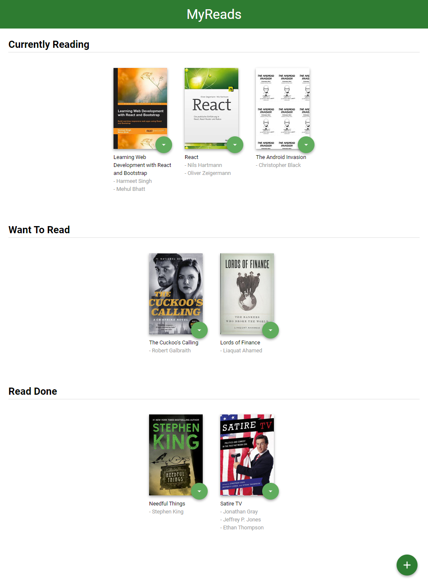

# ⚛React Nanodegree 1st Project <MyReads>📚

A Respository for Udacity's React Nanodegree course Project 1: MyReads: A Book Tracking App

## 📌Table of Contents

- [Demo](#demo)
- [Screenshots](#screenshots)
- [Getting Started](#getting-started)
- [Added Features](#added-features)
- [Copyright and License](#copyright-and-license)

# Demo

Deployed to [Github Pages](https://caesiumy.github.io/reactnd-myreads/#/)

## 📷Screenshots

<details>
    <summary>Home</summary>
    </img>
</details>
<details>
    <summary>Search</summary>
    </img>
</details>
<details>
    <summary>Search Results</summary>
    </img>
</details>

## 🎬Getting Started

### Step 1. Clone this Repository

```
git clone https://github.com/CaesiumY/reactnd-myreads.git
```

### Step 2. Get inside!

```
cd reactnd-myreads
```

> Many people accidently forgot to do this.

### Step 3. Install required packages

```
npm install
```

### Step 4. Run on Local Server

```
npm start
```

## 🎈Added Features

#### Add Loading popup to notice the state

Loading popup appears when getting data from the API.

### Deployed to GitHub Pages

To do this, I changed `BrowserRouter` to `HashRouter`

## 📜Copyright and License

[myreads starter](https://github.com/udacity/reactnd-project-myreads-starter) by Udacity.
